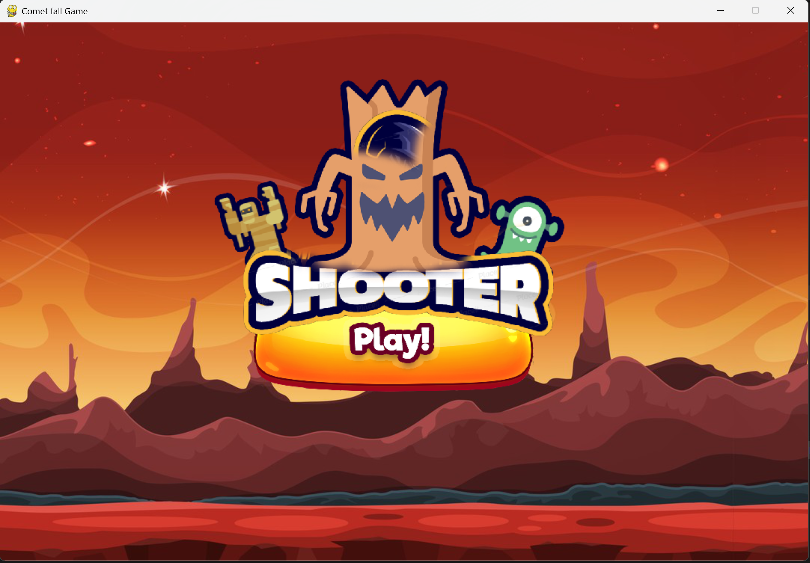
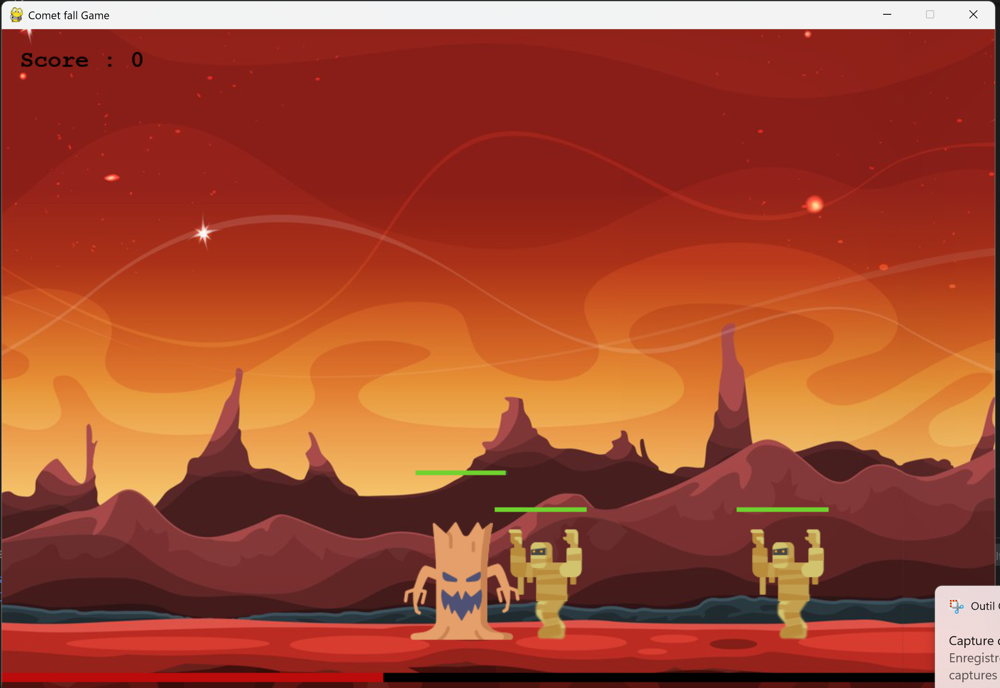
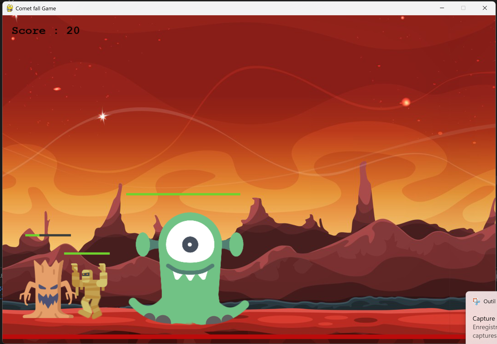

# Shooter Comet – Python / Pygame

Un jeu d’action développé en Python avec **Pygame**, inspiré du tutoriel de Graven sur la création de jeux. Dans ce shooter dynamique, le joueur doit survivre face à des vagues d’ennemis tout en évitant des comètes tombant du ciel.

## 🎮 Caractéristiques principales
- **Gameplay riche :** Attaque et défense face à deux types d’ennemis – **aliens** et **momies** – chacun avec ses propres comportements.
- **Système de score et de PV :** Suivi des points, des vies et de la santé du personnage.
- **Animations des personnages :** Mouvements et attaques fluides pour le joueur et les ennemis.
- **Menu interactif :** Accès facile au jeu, options et scores.
- **Événements dynamiques :** Après un certain temps, une **pluie de comètes** s’abat sur le terrain, augmentant la difficulté.
- **Effets sonores :** Sons pour les attaques, explosions et événements spéciaux, ajoutant de l’immersion.

## 🕹️ Captures d’écran

